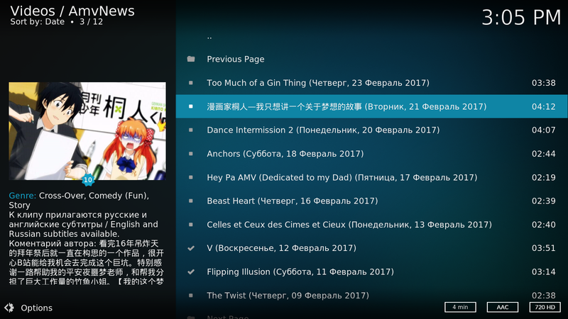
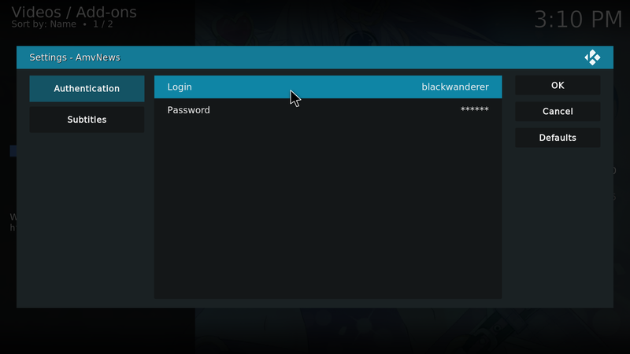

# kodi-amvnews
Unofficial Kodi plugin to watch anime music video from [AmvNews](http://amvnews.ru).

## Features
* Obtain list of featured, evaluated and favourite AMV 
* Obtain brief AMV info; Watched AMV are marked 
* Obtain detailed AMV info  
* Evaluate AMV or add it to favourites  
* Watch AMV (subtitles are supported) 

## Installation
1. Download [the latest release](https://github.com/pvantonov/kodi-amvnews/releases) (file should be named plugin.video.amvnews-x.x.x.zip)
2. Install it through System > Settings > Add-ons > Install from zip file

## Configuration
1. One should specify his username and password for [AmvNews](http://amvnews.ru) to be able to evaluate AMV and add it to favourites. It also allows one to watch his lists of favourite and evaluated AMV. 
2. One can specify preferable subtitles language. If subtitles for specified language isn't available the first attached subtitles will be used. 
